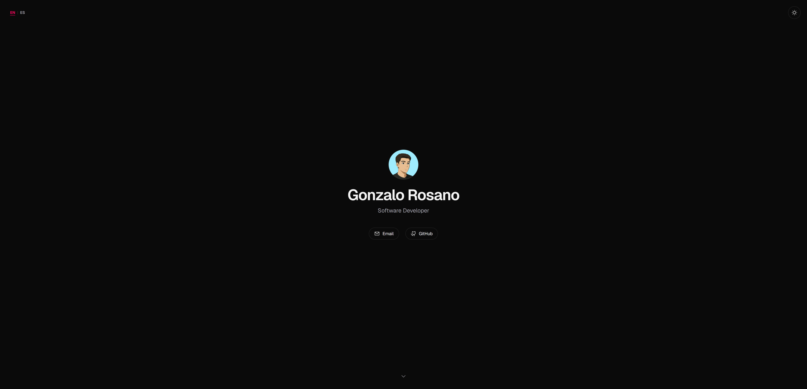

<div align="center">

# 🌐 grosano

**Gonzalo Rosano's personal landing page** — static site, simple, with carefully crafted animations.


</div>



---

## 📖 About the project

Personal landing page, minimal, built to be simple to maintain. No backend, no database: it's 100% **static**, exported with Next.js and served directly by nginx, with no Node process running on the server.

The presentation section ("About me") **isn't hardcoded** — it's fetched at build time from the [GitHub profile README](https://github.com/GonzaloRosano/GonzaloRosano) and rendered with the same visual style GitHub uses.

---

## ✨ Features

- 🎬 Animated entrance transition with GSAP
- 🧲 Magnetic hover on contact links
- 🌗 Light/dark theme switch, persisted in `localStorage`
- 🖱️ Smooth scroll with Lenis + visual scroll indicator
- 📄 "About me" section with real content from the GitHub profile, styled identically to GitHub (`github-markdown-css`)
- 🌐 Full site in English/Spanish, auto-detected with a manual toggle
- 📱 Fully responsive

---

## 🛠️ Stack

| Category | Technology |
|---|---|
| Framework | [Next.js](https://nextjs.org) (static export, `output: "export"`) |
| Styling | Tailwind CSS v4 + `@tailwindcss/typography` |
| Animation | [GSAP](https://gsap.com) + [Lenis](https://lenis.darkroom.engineering) |
| Dynamic content | `react-markdown`, `remark-gfm`, `rehype-raw`, `github-markdown-css` |
| Icons | [Phosphor Icons](https://phosphoricons.com) |

---

## 🚀 Local development

```bash
npm install
npm run dev
```

Open [http://localhost:3000](http://localhost:3000).

---

## 📦 Build

```bash
npm run build
```

Generates a static export in `out/` — HTML/CSS/JS only, no Node server.

---

## ☁️ Deploy

The site is served with **plain nginx**, no Node running 24/7 on the server. `deploy.sh` automates the whole cycle: build, package, and upload over SSH.

```bash
bash deploy.sh
```

> Requires the SSH key configured at the path set inside the script. The server's `sudo` password can be passed via the `SUDO_PASS` environment variable, or falls back to the interactive prompt.

---

## 🔄 Updating "About me"

That section's content is fetched at build time from [GonzaloRosano/GonzaloRosano](https://github.com/GonzaloRosano/GonzaloRosano). To reflect changes:

1. Edit the README in that repo
2. Run `bash deploy.sh` here

---

<div align="center">

Made by [Gonzalo Rosano](https://github.com/GonzaloRosano)

</div>
